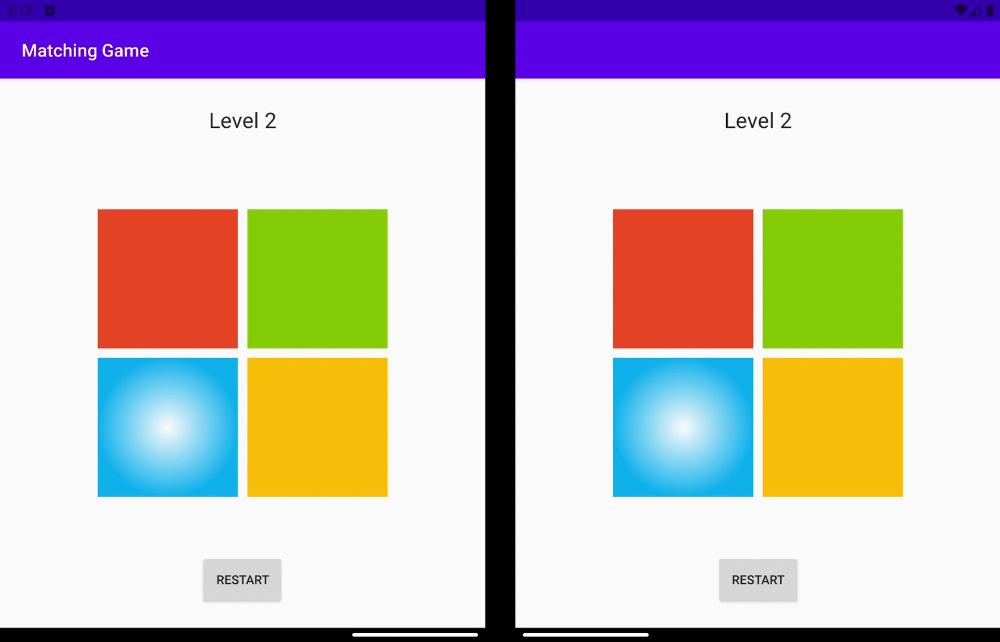
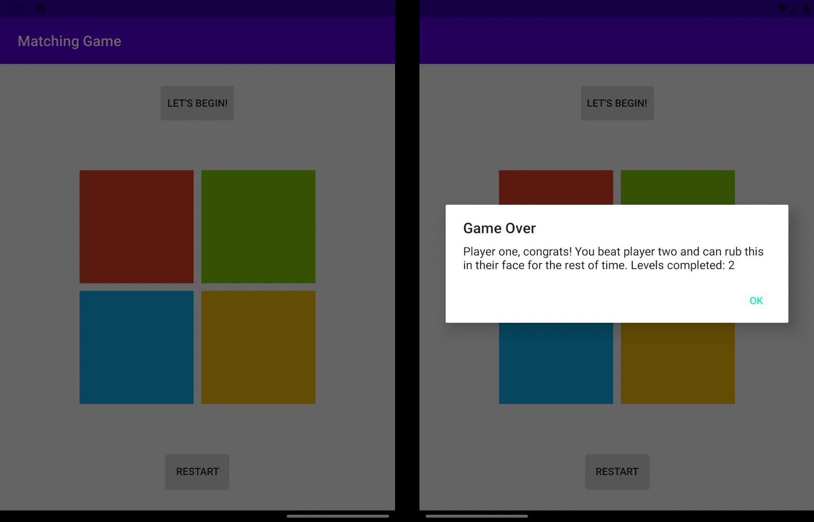
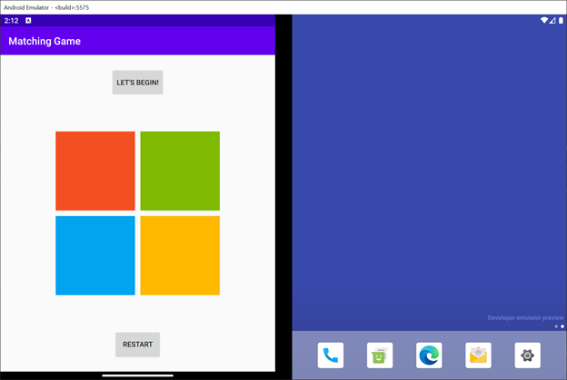

# Multiplayer Pattern Matching Game

This Kotlin application implements a simple pattern matching game that can be played as singleplayer or multiplayer. Screenshots of the application and its behavior are available [here](screenshots/).

## Prerequisites

* Android Studio
* Surface Duo emulator

## Running the sample

* Start Android Studio.
* Open the MatchingGame project: **File > Open**, navigate to file location of the  the **MatchingGame** folder, then click **OK**.
* Build your project: **Build > Make Project** or **Ctrl+F9**
* Start the Surface Duo emulator
* Select **"Microsoft SurfaceDuoEmulator API 29"** or **"Virtual Device"** from the list of Running Devices.
* Run the project on the emulator: **Run > Run 'app'**, **Ctrl+F2**, or click the green play button.

## Key concepts

### App features

* Begin a game: click on the "Let's Begin!" button to start a new game
* Restart a game: click on the "Restart" button to reset current game to beginning
* Playing a game: a series of buttons will flash for each level of the game; repeat that pattern to advance to the next level
* Advancing to the next level: click on the "Start Level" button after successfully repeating a pattern to advance

### Multiplayer

This app supports multiplayer mode where two different players can compete against each other at the same time. Each player has their own screen (and set of buttons) to repeat patterns generated by the game. Players will be able to advance levels only after both players have completed the pattern successfully. If one player fails, the other wins and gains bragging rights!

### Singleplayer

In singleplayer mode, one player can challenge themselves to complete all levels of the game. If they fail to repeat a pattern, they can restart and try again. If they complete all of the levels, a congratulatory dialog will appear with a link to a secret feature of the game!

### Secrets

This app contains a secret feature that utilizes the unique qualities of a dual screen device. Can you figure out what it is? If you can't handle the suspense, take a peek in the screenshots folder [here](screenshots/).

## Contributing

This project welcomes contributions and suggestions.
